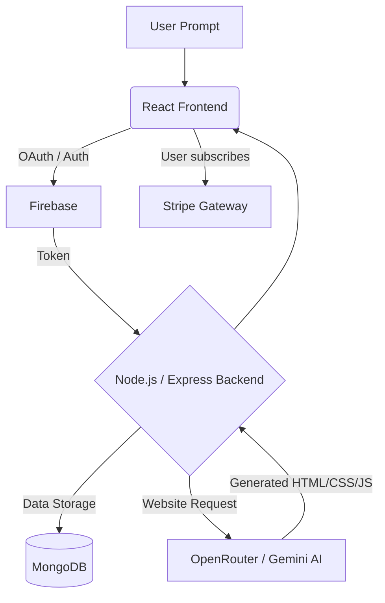

<div align="center">
  

  # 🚀 GenWeb.AI
  **The Next-Generation AI Website Builder SaaS**

  <p align="center">
    Empowering users to generate fully functional, production-ready websites from simple natural language prompts.
    <br />
    <a href="#-project-overview"><strong>Explore the docs »</strong></a>
    <br />
    <br />
    <a href="#-system-architecture">Architecture</a>
    ·
    <a href="#-getting-started">Getting Started</a>
    ·
    <a href="#-contact">Contact</a>
  </p>
</div>

---

<details>
  <summary>Table of Contents</summary>
  <ol>
    <li><a href="#-academic-information">Academic Information</a></li>
    <li><a href="#-project-overview">Project Overview</a></li>
    <li><a href="#-key-features">Key Features</a></li>
    <li><a href="#-tech-stack">Tech Stack</a></li>
    <li><a href="#-system-architecture">System Architecture</a></li>
    <li><a href="#-getting-started">Getting Started</a></li>
    <li><a href="#-project-team">Project Team</a></li>
    <li><a href="#-contact">Contact</a></li>
  </ol>
</details>

## 🎓 Academic Information

This project is submitted in partial fulfillment of the requirements for the **B.Tech Final Year Major Project**.

| Category | Details |
| :--- | :--- |
| **University** | Arka Jain University, Jamshedpur |
| **Department** | Computer Science & Engineering |
| **Academic Year** | 2022–2026 |
| **Supervisor** | **Prof. Rashid Anwar** |

---

## 📖 Project Overview

**GenWeb.AI** is a cutting-edge SaaS platform designed to democratize web development. By leveraging advanced Large Language Models (LLMs), it translates natural language requirements into complete, responsive, and functional websites (HTML, CSS, and JS). 

Whether you are a small business owner, a freelancer, or a developer looking to prototype rapidly, GenWeb.AI significantly reduces the time, effort, and cost associated with traditional web development while ensuring high-quality output.

### 🎯 Core Objectives
*   **Zero-Code Development:** Automate the entire website creation process using AI.
*   **Intuitive UX:** Provide a seamless, user-friendly interface for generating and refining websites.
*   **Cost & Time Efficiency:** Drastically cut down development cycles from weeks to seconds.
*   **Production-Ready Code:** Generate robust, responsive, and clean code that is ready for instant deployment.

---

## ✨ Key Features

*   🤖 **AI-Powered Generation:** State-of-the-art NLP models understand your prompt and build UI/UX instantly.
*   📱 **Responsive Design First:** All generated websites are mobile-friendly and adaptable to all screen sizes.
*   💳 **SaaS Monetization:** Fully integrated with Stripe for seamless subscription and credit-based payment models.
*   ⚡ **Real-Time Preview & Editing:** View your AI-generated website in real-time and make iterative changes using natural language.
*   ☁️ **Cloud Deployment Ready:** Optimized for easy hosting on platforms like Render, Vercel, or Netlify.
*   🔒 **Secure Authentication:** Robust user authentication and secure data handling.

---

## 🛠️ Tech Stack

Our platform is built on a modern, highly scalable architecture, utilizing the latest technologies for optimal performance.

### 🎨 Frontend
<p>
  
  
  
</p>

### ⚙️ Backend & Database
<p>
  
  
  
  
</p>

### 🧠 AI & Services
<p>
  
  
  
</p>

---

## 🏗️ System Architecture



---

## 🚀 Getting Started

Follow these steps to set up the project locally.

### Prerequisites
*   Node.js (v18 or higher)
*   MongoDB instance (Local or Atlas)
*   Stripe Account (for payment webhooks)
*   OpenRouter / Gemini API Keys

### Installation

1. **Clone the repository**
   ```bash
   git clone https://github.com/dev-aashu/websiteBuilder.git
   cd websiteBuilder
   ```

2. **Setup the Server (Backend)**
   ```bash
   cd server
   npm install
   ```
   *Create a `.env` file in the `server` directory:*
   ```env
   PORT=5000
   MONGO_URI=your_mongodb_connection_string
   JWT_SECRET=your_jwt_secret
   STRIPE_SECRET_KEY=your_stripe_secret_key
   OPENROUTER_API_KEY=your_openrouter_api_key
   ```
   *Start the server:*
   ```bash
   npm run dev
   ```

3. **Setup the Client (Frontend)**
   ```bash
   cd ../client
   npm install
   ```
   *Create a `.env` file in the `client` directory (if needed):*
   ```env
   VITE_API_BASE_URL=http://localhost:5000
   VITE_STRIPE_PUBLIC_KEY=your_stripe_public_key
   VITE_FIREBASE_API_KEY=your_firebase_api_key
   VITE_FIREBASE_AUTH_DOMAIN=your_firebase_auth_domain
   ```
   *Start the client:*
   ```bash
   npm run dev
   ```

---

## 👨‍💻 Project Team

| Name | Role | Contact |
| :--- | :--- | :--- |
| **Ashish Mahato** | Lead Developer | [ashishmahato650@gmail.com](mailto:ashishmahato650@gmail.com) |
| **Akash Prajapati** | Developer | [akashboss8969@gmail.com](mailto:akashboss8969@gmail.com) |
| **Rakesh Singh** | Developer | [dreamliferakesh@gmail.com](mailto:dreamliferakesh@gmail.com) |
| **Mohit Gupta** | Developer | [mohit.guptakr@gmail.com](mailto:mohit.guptakr@gmail.com) |

---

## 📞 Contact

For any inquiries or feedback regarding this project, please reach out:

*   **Ashish Mahato** - [ashishmahato650@gmail.com](mailto:ashishmahato650@gmail.com)
*   **Project Link:** [https://github.com/dev-aashu/websiteBuilder](https://github.com/dev-aashu/websiteBuilder)

---
<div align="center">
  <p>Made with ❤️ by the GenWeb.AI Team</p>
</div>
